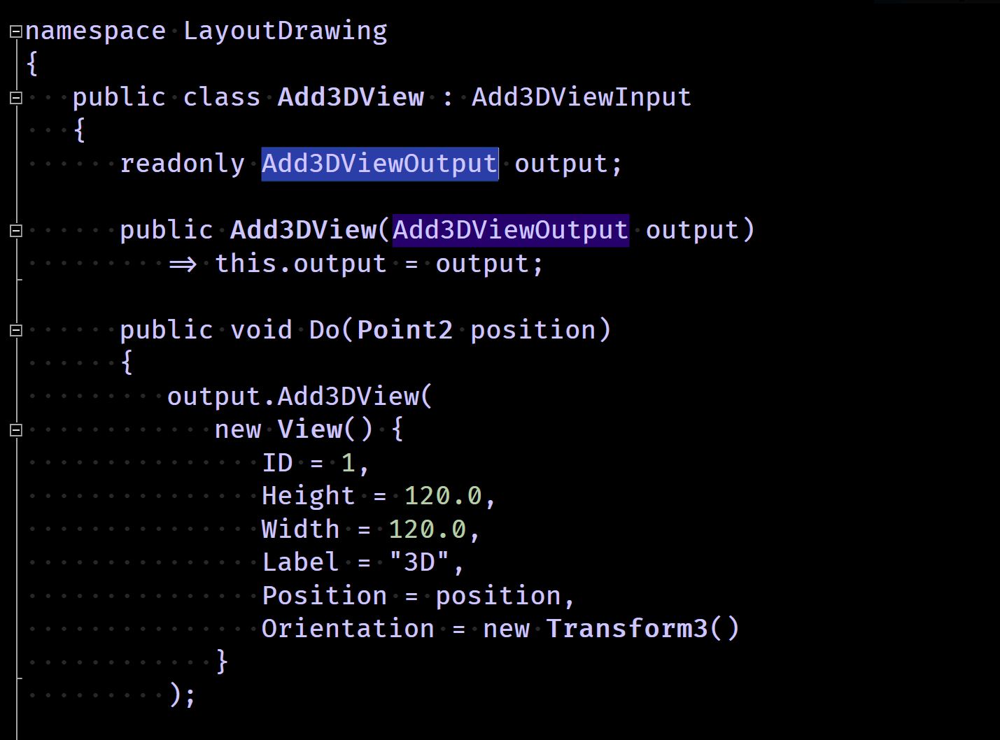
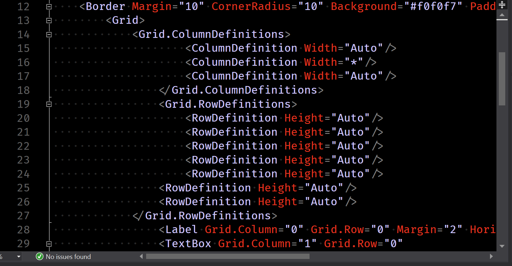

# VisualStudioSettings
A place for my Visual Studio Settings. 
These are currently focused around C# and XAML so outside 
of that it might well be unusable. Sorry. Feel free to contribute back.

This is a very flat style - I prefer to mostly remove the syntax highlighting
to force a focus on the layout and naming in the file.

